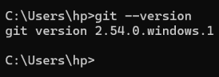
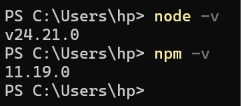
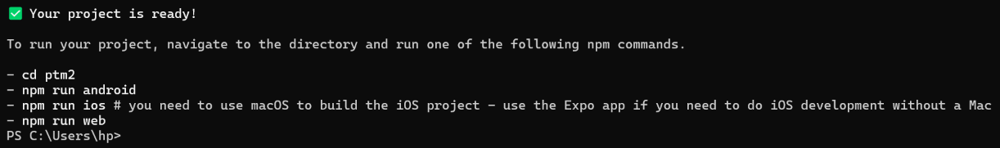
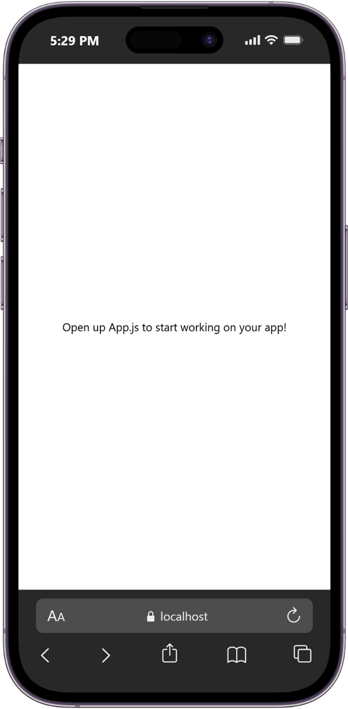
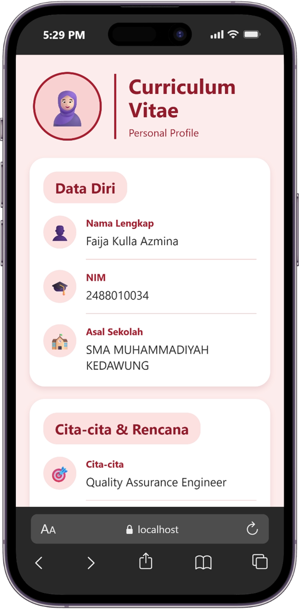
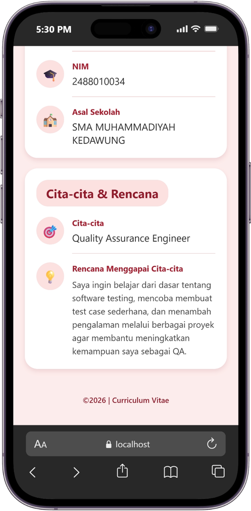

# Pratikum Menyiapkan Lingkungan Pengembangan dan Memulai Pemrograman Mobile (React Native) #

## Tujuan Pembelajaran ##
Mahasiswa mampu :
1. Menyiapkan lingkungan pengembangan dan memulai pemrograman mobile (React Native)
2. Membuat aplikasi mobile dengan React Native 
3. Menyelesaikan Tugas CV sederhana dengan React Native 

## Materi dan Laporan Praktikum ##
1. Menyiapkan lingkungan pengembangan dan memulai pemrograman mobile (React Native)
- Memastikan instalasi Git bash
   - Cek instalasi Git bash (git --version)
   - Bukti verifikasi 
   
- Memastikan Node.js dan NPM 
   - Download dan install Node.js di https://nodejs.org/en/download/
   - Konfirmasi Node.js dan NPM (node -v, npm -v)
   

2. Membuat aplikasi/project baru dengan React Native Framework Expo Go 
- Buka dan baca dokumentasi resmi link https://docs.expo.dev/
- Buka dan baca dokumentasi resmi link https://reactnative.dev/docs/getting-started
- Memulai membuat project baru 
- Open terminal change directory ke Pertemuan-2 
- Masukan perintah (npx create-expo-app ptm2 --template blank)
- Bukti verifikasi 

3. Running Project
 - cd ke ptm2
 - npx expo start 
 - Install Expo Go di Android atau IOS 
 - Bisa juga menggunakan Web simulator di Laptop/PC 
 - Setelah running diberhentikan (ctrl + C)
 - Install (npx expo install react-dom react-native-web)
 - npx expo start --web
 - Konfirmasi keberhasilan

 
 
4. Tugas Praktikum 
   - Membuat aplikasi CV sederhana dengan React Native 
   - Nama Lengkap 
   - NIM 
   - Asal sekolah 
   - Cita-cita 
   - Rencana menggapai cita-cita 
   - Konfirmasi keberhasilan

   
   

  
   
    

   