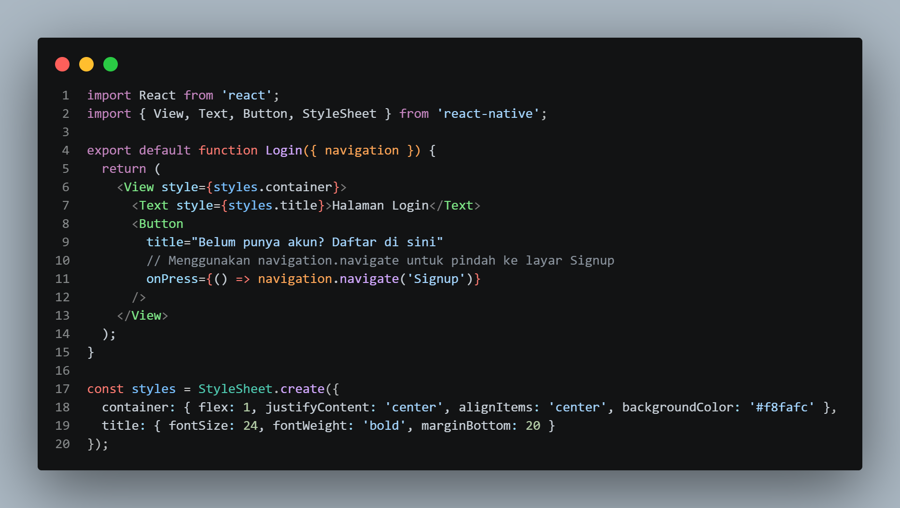
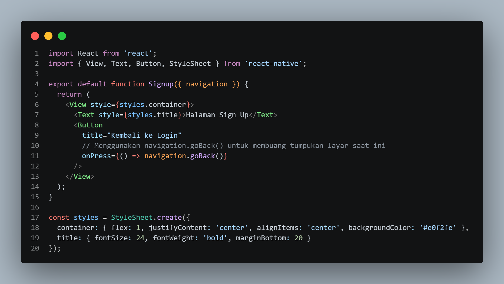
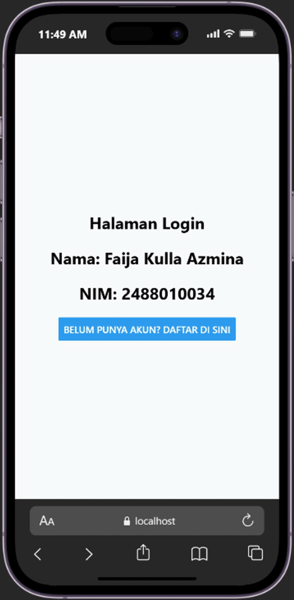
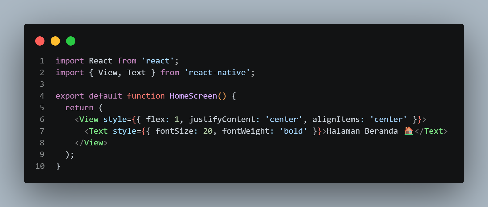
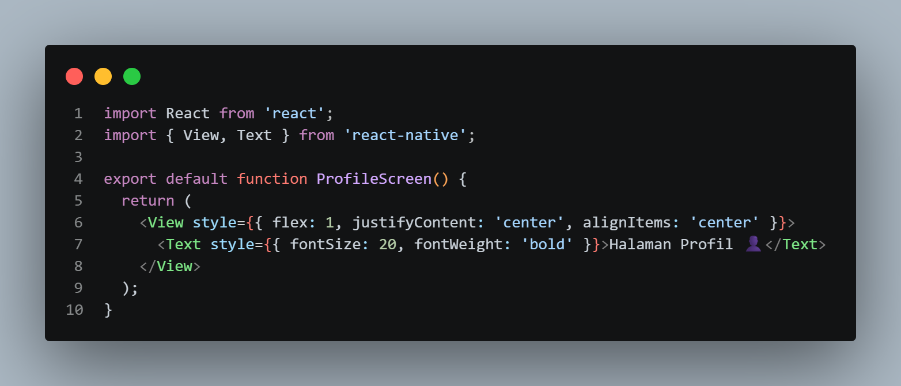
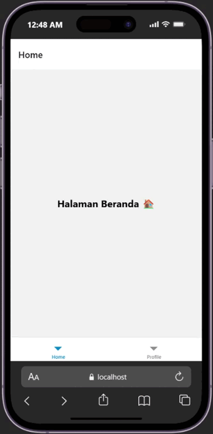
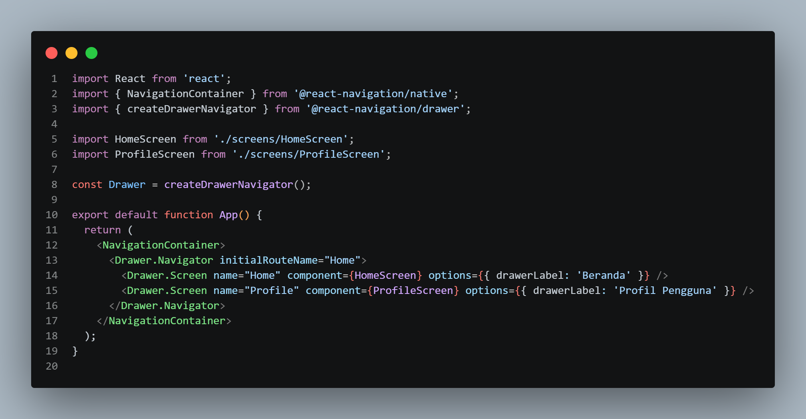
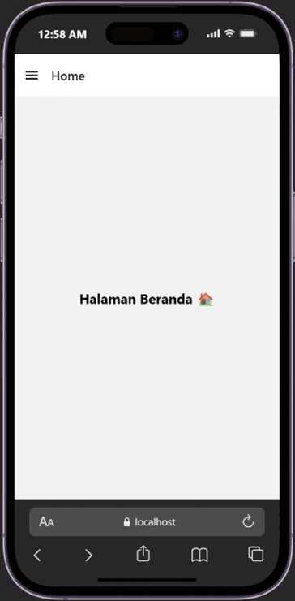

# Laporan Praktikum 4: React Native Navigation #

## Tujuan Pembelajaran ## 
Mahasiswa mampu:
1. Merancang dan menerapkan navigasi antar layar (screen) pada aplikasi React Native
2. Menggunakan library React Navigation (Stack  Navigation, Tab Navigator, Drawer Navigation)

## Alur Praktikum 
## A. Praktikum 1: Stack Navigation

### Langkah 1: Inisialisasi Proyek dan Instalasi Proyek dan Instalasi Dependencies React Native ###
1. Buka terminal atau command prompt
2. Ubah directory ke folder Pertemuan-4 (cd "Pemrograman Mobile\Pertemuan-4")
3. Buat proyek baru menggunakan perintah berikut: 'npx create-expo-app ptmn4 --template blank'
4. Masuk ke dalam folder proyek menggunakan perintah berikut: 'cd ptmn4'
5. Install core navigation library (npm install @react-navigation/native)
6. Install dependensi pendukung (wajib untuk Expo) 'npx expo install react-native-screens
react-native-safe-area-context react-native-gesture-handler react-native-reanimated

### langkah 2: Membuat Stack Navigator ###
1. Instalasi Pustaka Stack: npm install @react-navigation/native-stack
2. Buat folder didalam projek dengan nama screens 
3. Didalam folder screens buat 2 file dengan nama Login.js dan Signup.js
4. Masukkan kode sesuai pada Modul Praktikum 4
5. Sesuaikan file App.js dengan kode yg ada pada modul 
6. Simpan dan install dependensi untuk web 'npx expo install react-dom react-native-web'
7. Jalankan perintah 'npx expo start --web'  lalu tekan w pada terminal untuk membuka aplikasi di web browser
8. Konfirmasi Bukti 

 

## B. Praktikum 2: Bottom Tab Navigation

Tab Navigation menampilkan menu menetap di bagian bawah layar (seperti aplikasi Instagram/WhatsApp).

1. Instalasi Pustaka Bottom Tabs: npm install @react-navigation/bottom-tabs

2. Membuat Layar Baru yaitu file `HomeScreen.js` dan `ProfileScreen.js` di dalam folder `screens`

3. Konfigurasi Tab di `App.js` dengan mengubah isi `App.js` menjadi seperti kode yang sudah ditentukan pada modul praktikum

## C. Praktikum 3: Drawer Navigation

Drawer menampilkan panel navigasi samping (sidebar) yang dapat digeser atau dibuka melalui ikon Hamburger.

1. Instalasi Pustaka Drawer: npm install @react-navigation/drawer

2. Konfigurasi Drawer di `App.js` dengan mengubah kembali file `App.js` untuk mencoba Drawer Navigation menggunakan layar Home dan Profile yang sudah dibuat sebelumnya

